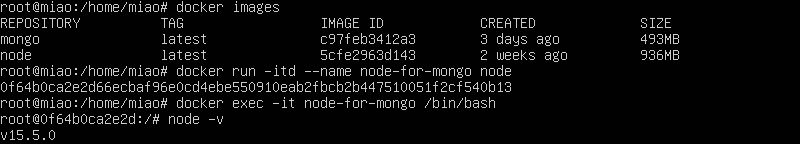

#### 1.拉取镜像
`docker pull mongo:latest`
#### 2.查看镜像
`docker images`
#### 3.开启镜像mongo
第一次运行 `docker run -itd --name mongo -p 27017:27017 mongo  --auth`  
重新运行 `docker start mongo`
#### 4.添加mongo管理员用户并设置密码
`docker exec -it mongo mongo admin`  
  
参考链接：https://www.runoob.com/docker/docker-install-mongodb.html
#### 5.创建node示例
 
#### 6.重启docker服务
通用命令`sudo service docker restart`，但本机的docker是在安装Ubuntu时一起安装的，故需使用命令`sudo snap restart docker`。参考报错
`Failed to restart docker.service: Unit docker.service not found.`
#### 7.重启容器
`docker restart my-node`
#### 8.进入容器
`docker exec -it 733b bash`,使用container前四位字母也可启动（键值唯一的话）
#### 9.删除容器
`docker container rm my-node`
