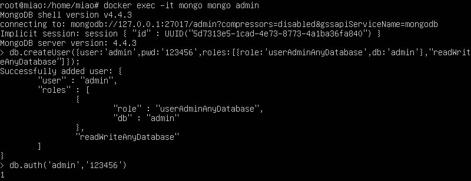

#### 1.拉取镜像
`docker pull mongo:latest`
#### 2.查看镜像
`docker images`
#### 3.开启镜像mongo
第一次运行 `docker run -itd --name mongo -p 27017:27017 mongo  --auth`  
重新运行 `docker start mongo`
#### 4.添加mongo管理员用户并设置密码
`docker exec -it mongo mongo admin`  
  
参考链接：https://www.runoob.com/docker/docker-install-mongodb.html
