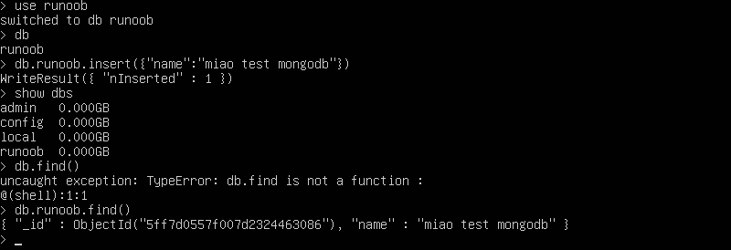

### 0.进入mongo
进入容器后，输入`mongo`,开启mongo命令行
### 1.添加数据库
`use runoob`,runoob是数据库的名称
### 2.插入数据
`db.runoob.insert({"name::"miao test mongodb"})`
### 3.查看数据
`db.runoob.find()`等价于select *  
  
### 4.退出
`exit`
### 5.查看mongo数据库
`show dbs`
