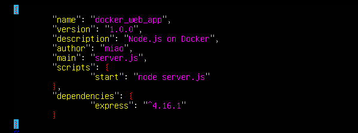
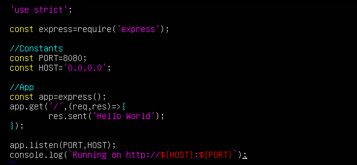
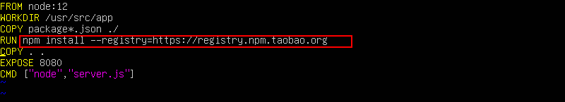
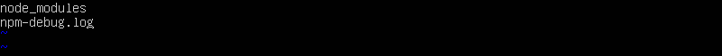
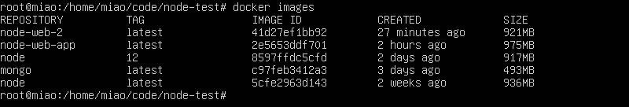

### 创建node app
##### 参考教程:https://nodejs.org/en/docs/guides/nodejs-docker-webapp/
#### 一、新建package.json
  
#### 二、运行`npm install`
#### 三、新建server.js
  
#### 四、新建Dockerfile
  
#### 五、新建.dockerignore
  
#### 六、构建镜像
构建镜像`docker build -t node-web-2 .`  
查看镜像`docker images`  
  
#### 七、运行镜像
运行镜像`docker run -p 49160:8080 -d node-web-2`  
查看container id`docker ps`  
打印输出`docker logs <container id>`  
