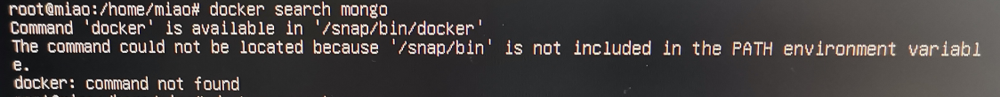
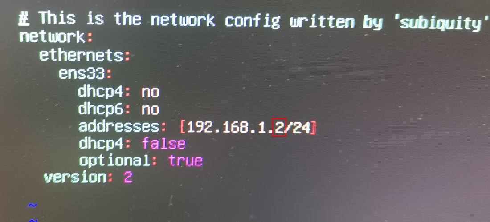

### 添加环境变量

#### 0.sudo su进入控制台
#### 1.打开环境配置文件
`sudo nano /etc/environment`
#### 2.文件末尾添加新路径
`:/snap/bin`
#### 3.保存后退出
Ctrl+X ，Y
#### 4.重启
`shutdown -r now`

### 配置ubuntu网络IP
问题描述：vm桥接模式，ubuntu ipv4 enss没有ip
#### 1.编辑配置文件
`vim /etc/netplan/00-installer-config.yaml`

